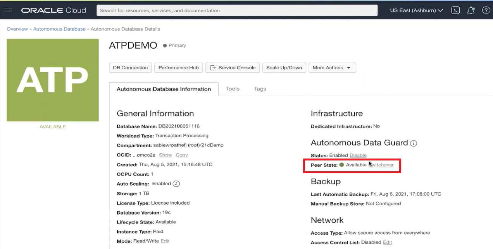

Configure Disaster Recovery (Autonomous Data Guard)

## Introduction
In this demo, we're going to cover disaster recovery on Autonomous Database. 

Estimated Time: 5 minutes

### Objectives
- Enable Autonommous Data Guard
- Perform a manual switchover

### Prerequisites
  This lab assumes you have:
  - Provisioned a Autonomous Database

## Enable Autonomous Data Guard

1. From the Autonomous Database Details page, click on the Autonomous Data Guard Enable link. 

    

2. Autonomous Data Guard is now being enabled on my ATP Demo instance. You'll notice that the peer state is in provisioning, and there is a switchover link that is now available.

    

## Perform a manual switchover. 
3. Confirm the switchover to the standby database by entering the database name. 

    

4. Note that this database name is the actual database name in the database name section on the details page. 

    

5. Once the switchover is complete, the status will go from updating to available.

    

This concludes this lab. You may now proceed to the next lab.

## Acknowledgements

- **Author** - Kamryn Vinson, Product Manager, Oracle Database
- **Contributor** - Nicholas Cusato, Solution Engineer, Santa Monica Specialist Hub
- **Last Updated By/Date** - Nicholas Cusato, Santa Monica Specialist Hub, March 2022
